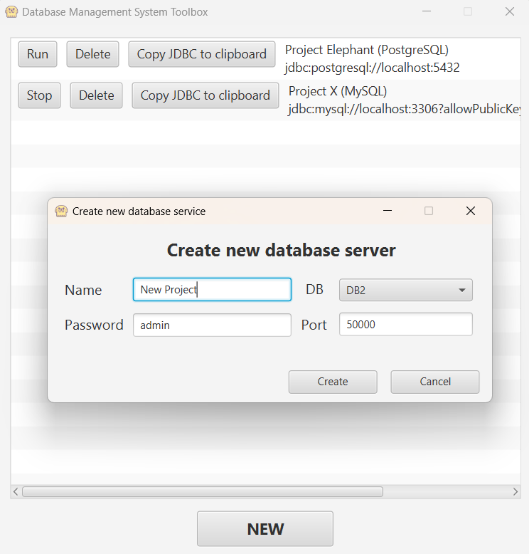

# DATABASE MANAGMENT SYSTEM TOOLBOX

This program is a launcher that allows you to easily launch 
PostgreSQL, MySQL, MariaDB, DB2 database instances using Docker.

### Build

To build jar - `mvn clean package`

> Note: Don't forget to place config.json next to the .jar before you run it